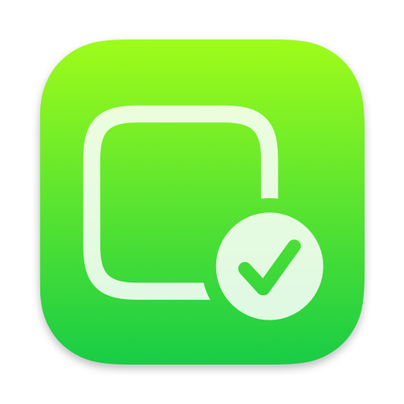

# Whitelist
### Jailed iOS app to un-blacklist all enterprise-signed apps

## Compatibility
iOS and iPadOS **15.0-16.1.2**

Anything above this is ***not*** supported, don't bother me about it.

## What is it?
Have you ever seen this annoying prompt?

Well this app removes this!

No really, it's that simple.
